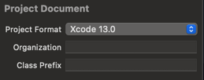

<div align="center">

# SPCreator
---

[](https://github.com/Lguanghui/SPCreator/actions/workflows/cmake-single-platform.yml)


English / [中文](https://github.com/Lguanghui/SPCreator/blob/main/README_zh-CN.md)

SPCreator is a command-line tool for creating Swift Packages and generating project templates.

</div>

## Introduction

In Xcode Project, the files we create usually have a fixed format header, such as:

```
//
//  MyFile.swift
//  MyModule
//
//  Created by MyName on 2023/3/26.
//  Copyright © 2023 My Company. All rights reserved.
//
```

Where copyright is only present when an Organization is set. We can also set a class prefix, so that each newly created class will have a fixed prefix.



However, in a Swift Package, class prefixes, copyright, and even file headers cannot be directly set. They need to be set through an IDETemplateMacros.plist file.

Bare file header ⬇️:

```
//
//  FileName.swift
//
//
//  Created by Your Name on 2022/2/20.
//
```

The IDETemplateMacros.plist file is not automatically created when creating a package, so we need to manually create it and fill in the information, which is a cumbersome process.

SPCreator is born to simplify these steps. It can not only create a Swift Package, but also automatically create the IDETemplateMacros.plist file in the appropriate location, and fill in and format its contents.

## Installation

### Homebrew

Tap:

```
brew tap Lguanghui/tap
```

Core:

```
brew install spcreator
```

## Usage

| Command Line Argument | Description                                                                  |
|-----------------------|------------------------------------------------------------------------------|
| --help or -H          | Help documentation                                                           |
| --name or -N          | Specify the name of the package to create                                    |
| --classPrefix or -P   | Specify the prefix for newly created classes in the package                  |
| --authorName or -A    | Specify the author name or organization name for the file header's copyright |

Example:

`spcreator -N TestPackage -P GH -A Guanghui Liang`
